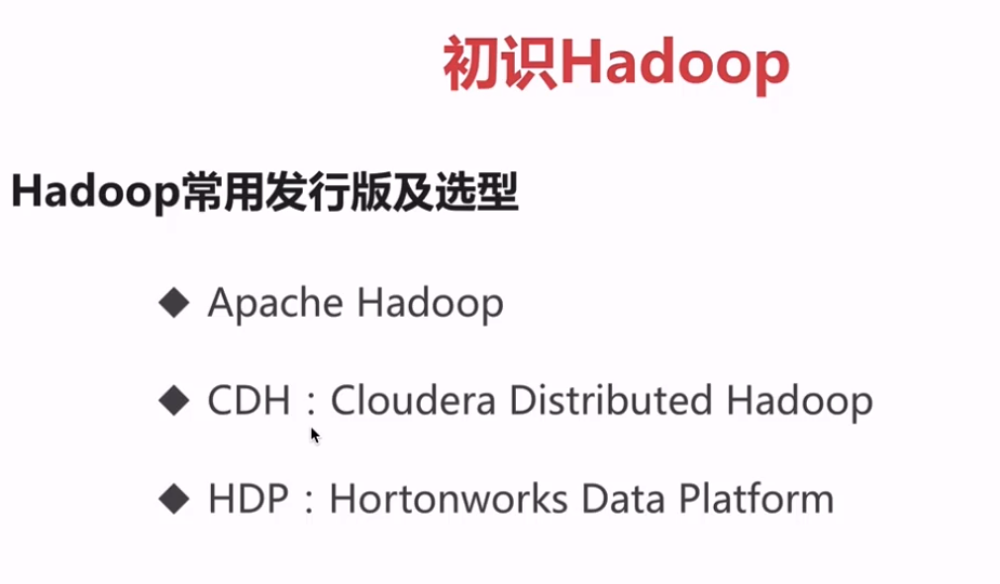
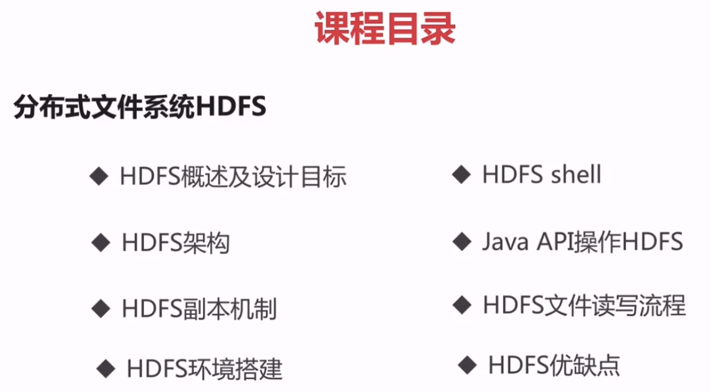

# 第1章 大数据概述 35:20

# 第2章 初识Hadoop  1:02:01

archive.cloudera.com/cdh5/cdh/5/

# 第3章 分布式文件系统HDFS   2:15:36

# 第4章 分布式资源调度Yarn      47:52

# 第5章 分布式计算框架MapReduce     1:49:43

# 第6章 Hadoop项目实战        1:11:00

# 第7章 Hadoop分布式集群搭建    42:58

# 第8章 Hadoop集成Spring的使用    33:56

# 第9章 前沿技术拓展Spark， Flink，Beam   1:22:11

# 第10章 Hadoop3.x 新特性    32:57

